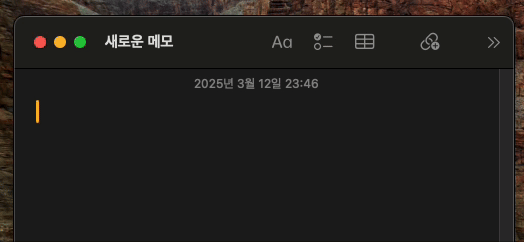

### README.md (Korean)

# AutoHangulEnglish 🌟 자동 한영 변환기

안녕하세요, 여러분! 🎉 **AutoHangulEnglish**에 오신 걸 환영해요! 이 프로젝트는 여러분의 타이핑을 한글과 영어 사이에서 똑똑하게 바꿔주는 멋진 도구예요! 실수로 영어로 썼는데 한글이어야 했다거나, 반대로 한글로 썼는데 영어로 바꿔야 할 때, 이 친구가 자동으로 알아서 바꿔준답니다! 특히 MacOS 사용자라면 지금 바로 써볼 수 있어요! (Windows 버전은 만드는 중)

---

## ✨ 특징

-   **실시간 감지**: 여러분이 타이핑하는 걸 보고 한글인지 영어인지 알아내요! AI가 똑똑하게 판단해줍니다. 🤖
-   **자동 변환**: 언어가 틀리면 바로 지우고 맞는 언어로 바꿔 타이핑해줘요! ✍️
-   **시스템 트레이**: 작업 표시줄에서 쉽게 켜고 끄고 설정할 수 있어요. 🖱️
-   **설정 맞춤**: 스페이스바로 처리할지, 버퍼 길이를 얼마나 할지, 자신감 임계값을 조정할 수 있어요! ⚙️
-   **일시정지**: `1+2+3` 키를 동시에 누르면 잠시 멈출 수 있어요. 편리하죠? ⏸️

---

## 🚀 설치 방법

### MacOS (지금 사용 가능! 🎉)

**릴리즈 다운로드**: [Releases 페이지](https://github.com/EmptyDeck/EnglishKoreanKeyboard/releases/tag/MAC_OS)에서 최신 MacOS 버전을 받아요!

### Windows (곧 출시! ⏳)

-   아직 준비 중이에요. 조금만 기다려주시면 윈도우에서도 멋지게 사용할 수 있을 거예요! 🙌

---

## 🎬 사용 방법

1. 앱을 실행하면 시스템 트레이에 아이콘이 생겨요.
2. 타이핑을 시작하면 자동으로 한글/영어를 감지해서 바꿔줘요!
3. 설정을 바꾸고 싶다면:
    - 트레이에서 "Settings"를 클릭! ⚙️
    - "Process on Space" 체크박스로 스페이스바 처리 여부를 설정하고, 버퍼 길이나 자신감 임계값을 조정할 수 있어요.

> **설정**: "hello"를 쳤다가 한글 "안녕"으로 바뀌는 과정을 GIF로 보여주세요!  
> 예: ``

4. 잠시 멈추고 싶을 땐? `1+2+3`을 동시에 눌러보세요! ⏸️

---

## 🛠️ 필요 조건

-   **MacOS**: 12.0+
